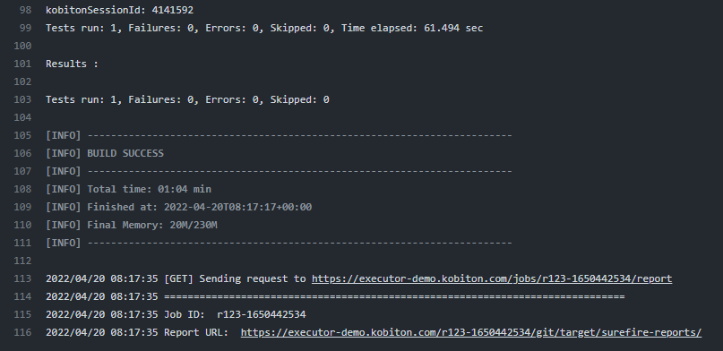

# Kobiton Action for Execute Appium Test

This is a GitHub action that allows you to utilize Kobiton automation testing, which makes it convenient for running auto script with many custom values like which executor will be used to perform, which device we need to take action or the repository of the test script

## Table of Contents

1. [Getting Started](#getting-started)
   - [Setup workflow and action](#setup-workflow-and-action)
   - [Setup secrets for private items](#setup-secrets-for-private-items)
2. [Input Variables](#input-variables)
3. [Test Result](#test-result)
4. [Some Notes](#some-notes)
5. [License](#license)

## Getting Started

### Setup Workflow and Action

To get started using the action for your project, create a folder called **.github** and inside it, create another folder called **workflows**. Finally inside the workflows folder, create a file called **main.yml** or any name with the following contents:

_.github/workflows/main.yml_

```yaml
on:
  push:
    branches:
      - main

jobs:
  run-test:
    runs-on: ubuntu-latest
    name: Input name for the job
    steps:
      - uses: actions/checkout@v3
      - uses: kobiton/execute-appium-test-github-action@<<version>>
        with:
          kobi_username: ${{ secrets.KOBI_USERNAME }}
          kobi_api_key: ${{ secrets.KOBI_API_KEY }}
          executor_url: https://example.com # get this from our support team
          executor_username: ${{ secrets.EXECUTOR_USERNAME }} # get this from our support team
          executor_password: ${{ secrets.EXECUTOR_PASSWORD }} # get this from our support team
          git_repo_url: https://github.com/sonhmle/azure-devops-sample-java-prod.git
          git_repo_branch: master
          git_repo_ssh_key: ${{ secrets.GIT_REPO_SSH_KEY }}
          app_id: kobiton-store:91041
          use_custom_device: 'true'
          device_name: 'Galaxy A20s'
          device_platform_version: '10'
          device_platform: 'Android'
          root_directory: '/'
          command: 'mvn test'
          wait_for_execution: 'true'
```

_For more info about how to customize a workflow, check out the [GitHub Actions documentation for workflow](https://docs.github.com/en/actions/using-workflows/workflow-syntax-for-github-actions). You can trigger the action on many other kinds of event._

### Setup Secrets for private items

Kobiton Username and API key are required for authenticating with Kobiton API.

> If you don't have a Kobiton account, visit https://portal.kobiton.com/register to create one.

To get your Kobiton Username and API Key, follow instructions at `IV. Configure Test Script for Kobiton` section on [our blog](https://kobiton.com/blog/tutorial/parallel-testing-selenium-webdriver/).

In your Repo, go to Settings -> Secrets/Actions and click on "New repository secret". Then enter KOBI_USERNAME as the name and paste the suitable value. The same process is followed for KOBI_API_KEY, EXECUTOR_USERNAME, EXECUTOR_PASSWORD, GIT_REPO_SSH_KEY.

_For more info about how to setup kinds of secrets, check out the [GitHub Actions documentation for secrets](https://docs.github.com/en/actions/security-guides/encrypted-secrets)_

You can now push your project to GitHub and it will be automatically triggered the action.

Success, right? You learn more about GitHub Actions [here](https://docs.github.com/en/actions)

## Input Variables

The action comes with additional options that you can use to configure the workflow. You can setup these values inside the "with" object as presented above:

| Input Environment Variable | Required                                      | Description                                                                                                                                                                           | Examples                                                     |
| -------------------------- | --------------------------------------------- | ------------------------------------------------------------------------------------------------------------------------------------------------------------------------------------- | ------------------------------------------------------------ |
| kobi_username              | yes                                           | The user in Kobiton                                                                                                                                                                   | _secret_                                                     |
| kobi_api_key               | yes                                           | Specific key to access Kobiton API                                                                                                                                                    | _secret_                                                     |
| executor_url               | yes                                           | Kobiton Automation Test Executor URL to perform the test, please contact our Support Team to get this                                                                                 | https://executor-demo.kobiton.com                            |
| executor_username          | yes                                           | Kobiton Automation Test Executor username, please contact our Support Team to get this Executor                                                                                       | _secret_                                                     |
| executor_password          | yes                                           | Kobiton Automation Test Executor password, please contact our Support Team to get this Executor                                                                                       | _secret_                                                     |
| git_repo_url               | yes                                           | Link to your Git repository                                                                                                                                                           | https://github.com/sonhmle/azure-devops-sample-java-prod.git |
| git_repo_branch            | yes                                           | The branch of your Git repository you want to execute automation test with                                                                                                            | master                                                       |
| git_repo_ssh_key           | optional                                      | It is used if your Git Repository is private                                                                                                                                          | _secret_                                                     |
| app_id                     | optional                                      | The App ID or App URL to use in your test script                                                                                                                                      | kobiton-store:275643                                         |
| use_custom_device          | yes                                           | Check if you want to execute one or some test cases with a specific Kobiton Cloud Device. If you already set your device information in your test script, leave this field unchecked. | true                                                         |
| device_name                | optional (yes when use_custom_device is true) | Kobiton Device Name                                                                                                                                                                   | Galaxy A20s                                                  |
| device_platform_version    | optional (yes when use_custom_device is true) | Kobiton Device platform version                                                                                                                                                       | 10                                                           |
| device_platform            | optional (yes when use_custom_device is true) | Kobiton Device platform                                                                                                                                                               | android                                                      |
| root_directory             | yes                                           | Input the root directory of your Git repository                                                                                                                                       | /                                                            |
| command                    | yes                                           | Command lines to install dependencies and execute your automation test script. These commands will run from the root directory of your Git repository                                 | mvn test                                                     |
| wait_for_execution         | yes                                           | Check if your want the release pipeline to wait until your automation testing is completed or failed, then print out the console log and test result                                  | true                                                         |
| log_type                   | optional                                      | Your desired log type to be showed. Choose Combined to show logs in chronological order, or specify a type of log ('output', 'error')                                                 | combined                                                     |

## Test result

The test result will be shown on GitLab console with report link, and the session will be listed in Kobiton Portal as mentioned above.



Your test session can be viewed on Kobiton website. Follow these steps below

1. Go to https://portal.kobiton.com/sessions, login with your Kobiton account.
2. You will see your executed sessions and their statuses.

3. Click on any session to view its details, commands.


## Some Notes

- You can find the secrets tab in your project's settings

- If you're using the above exact workflow code, keep in mind that it deploys whenever you make a change to the main branch (Even README updates which have nothing to do with application code) and that might not be very efficient for you, have a look through the GitHub Actions documents to customize when the action should trigger.

- When you face any issues with the action, feel free to open an issue for our [GitHub repository](https://github.com/kobiton/execute-appium-test-github-action/issues)

## License

This project is licensed for the MIT License [here](LICENSE).
